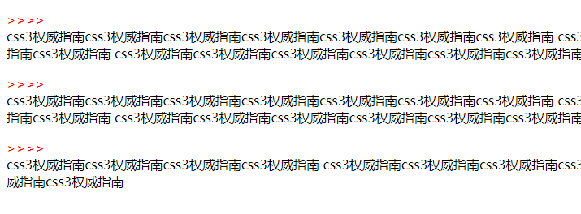
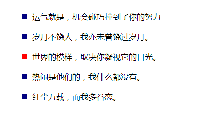
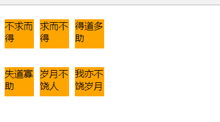

伪元素(跟标签差不多只是用css的方式来写)
    
    1、 ::before与::after
    注意：用::before一定要用content,设置宽高需转换成块，主要用来在某些地方开头插入小图标，文字等
         IE8不兼容::after，但可以兼容:after，所以为了更好的兼容，使用:after即可
```html
<!DOCTYPE html>
<html lang="en">
<head>
	<meta charset="UTF-8">
	<title>Document</title>
	<style type="text/css">
		/*表示在p元素内部开始位置插入content内容,并且颜色为红色
		转换成块，独占一行，一定要用content属性，没有内容就为空*/
		p::before {
			content: ">>>>";
			display: block;
			color: red;
		}
	</style>
</head>
<body>
	<p>css3权威指南css3权威指南css3权威指南css3权威指南css3权威指南css3权威指南css3权威指南
	css3权威指南css3权威指南css3权威指南css3权威指南css3权威指南css3权威指南css3权威指南
	css3权威指南css3权威指南css3权威指南css3权威指南css3权威指南css3权威指南css3权威指南
	css3权威指南css3权威指南css3权威指南css3权威指南css3权威指南css3权威指南css3权威指南
	css3权威指南css3权威指南css3权</p>
	<p>css3权威指南css3权威指南css3权威指南css3权威指南css3权威指南css3权威指南css3权威指南
	css3权威指南css3权威指南css3权威指南css3权威指南css3权威指南css3权威指南css3权威指南
	css3权威指南css3权威指南css3权威指南css3权威指南css3权威指南css3权威指南css3权威指南
	css3权威指南css3权威指南css3权威指南css3权威指南css3权威指南css3权威指南css3权威指南
	css3权威指南css3权威指南css3权</p> <p>css3权威指南css3权威指南css3权威指南css3权威指南
	css3权威指南css3权威指南css3权威指南css3权威指南css3权威指南css3权威指南css3权威指南
	css3权威指南css3权威指南css3权威指南css3权威指南css3权威指南css3权威指南css3权威指南
	css3权威指南css3权威指南css3权威指南</p>
</body>
</html>
```


```html
<!DOCTYPE html>
<html lang="en">
<head>
	<meta charset="UTF-8">
	<title>Document</title>
	<style type="text/css">
		ul {
			list-style: none;
		}

		ul li {
			position: relative;
			padding-left: 20px;
			line-height: 40px;
		}

		/*在li前面用::before插入一个盒子*/
		ul li::before {
			content:"";
			position: absolute;
			top: 50%;
			left: 0;
			margin-top: -5px;
			width: 10px;
			height: 10px;
			background-color: navy;
		}

		ul li:hover::before {
			background-color: red;
		}
	</style>
</head>
<body>
	<ul>
		<li>运气就是，机会碰巧撞到了你的努力</li>
		<li>岁月不饶人，我亦未曾饶过岁月。</li>
		<li>世界的模样，取决你凝视它的目光。</li>
		<li>热闹是他们的，我什么都没有。</li>
		<li>红尘万载，而我多眷恋。</li>
	</ul>
</body>
</html>
```


```html
<!DOCTYPE html>
<html lang="en">
<head>
	<meta charset="UTF-8">
	<title>Document</title>
	<style type="text/css">
		.box {
			width: 500px;
			height: 539px;
			border: 1px solid #000;
			position: relative;
			background: url("liushishi.jpg") center top;
			overflow: hidden;
			float: left;
		}

		.box::before {
			content: "刘诗诗";
			color: white;
			text-align: center;
			line-height: 539px;
			position: absolute;
			width: 500px;
			height: 539px;
			background-color: black;
			top: 539px;
			left: 0;
			opacity: 0.5;
			transition: all 0.4s ease 0s;
		}

		.box:hover::before {
			top: 0;
			box-shadow: inset 0px 0px 20px red;
		}
	</style>
</head>
<body>
	<div class="box"></div>
	<div class="box"></div>
	<div class="box"></div>
</body>
</html>
```


    ::after 清除浮动
```html
<!DOCTYPE html>
<html lang="en">
<head>
	<meta charset="UTF-8">
	<title>Document</title>
	<style type="text/css">
		p {
			float: left;
			width: 50px;
			height: 50px;
			background-color: orange;
			margin-right: 10px;
		}

		.cl::after {
			content: "";
			display: block;
			clear: both;
		}
	</style>
</head>
<body>
		<div class="cl">
			<p>不求而得</p>
			<p>求而不得</p>
			<p>得道多助</p>
		</div>
		<div class="cl">
			<p>失道寡助</p>
			<p>岁月不饶人</p>
			<p>我亦不饶岁月</p>
		</div>
</body>
</html>
```
