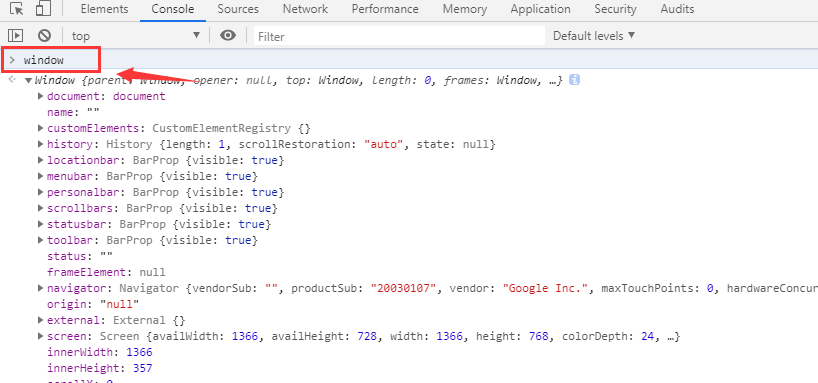

window对象

    （1）可在控制台输入：window 就会显示大部分对象
    例如：window.alert("ok"),其中window可以省略



    （2）定义的全局变量会挂载到window的对象下
    （3）定义的全局函数同样也会

```html
<script>
    var d = 100;
    alert(d);
    // alert(window.d) 跟上面的效果一致

    function fn() {
        alert(3);
    }
    fn()
    // window.fn() 跟上面效果一致
</script>
```


常用window对象

    弹窗：confirm() prompt() alert()
    定时器:setTimeout 每隔一段时间，执行某个函数的操作

```html
<!DOCTYPE html>
<html lang="en">
<head>
    <meta charset="UTF-8">
    <meta name="viewport" content="width=device-width, initial-scale=1.0">
    <meta http-equiv="X-UA-Compatible" content="ie=edge">
    <title>Document</title>
</head>
<body>
    <script>
        // 隔一秒钟显示i的值，时间的单位是毫秒，此例子为匿名函数也是函数
        var i = 0;
        window.setTimeout(function(){
            document.write(i);
        },1000)
    </script>
</body>
</html>
```
