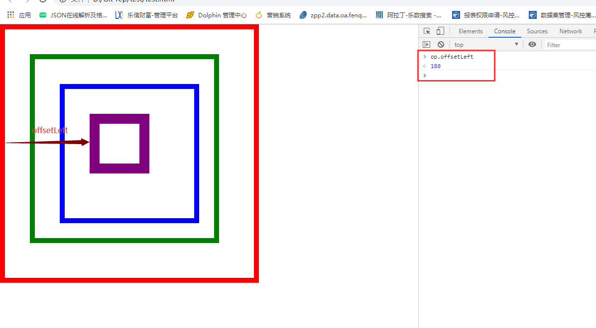

js盒模型属性
client
     width/height/top/left
     clientWidth padding+width
     clientLeft 左边框宽度
offset
    offsetWidth  padding+width+border
    offsetParent     
scroll
    scrollWidth 左border+内容真实宽
    scrollHeight 上border+内容真实高
===========================================
   offsetLeft/offsetTop  offsetParent

   offsetLeft 指的是元素与offsetParent之间的距离(参考点offsetParent)

   首先确定offsetParent参考点
      IE8+和高级浏览器
          假如祖先元素中都没有定位（绝对、固定、相对定位），offsetParent就是body元素,假如祖先元素有定位，则以最近的带有定位的祖先元素为准,与自己是否定位无关
      vue最低兼容到IE8，所以用了vue就兼容不到

      IE6/7浏览器
          自身没有定位，参考的是最近的有宽高的祖先元素，没有宽高参考的是body
          自身有定位 与高级浏览器一致

    offsetLeft 
        IE9+和高级浏览器，IE6/7
        元素自身的左边框外部到offsetParent左边框内部的距离 

        IE8 
        比高版本浏览器的offsetLeft多一个offsetParent边框   

    如何对offsetLeft做兼容？
          自身元素定位  祖先无边框        

==========================================


    确定offsetParent参考点
    IE8+和高级浏览器
    假如祖先元素中都没有定位（绝对、固定、相对定位），offsetParent就是body元素


```html
<!DOCTYPE html>
<html lang="en">
<head>
    <meta charset="UTF-8">
    <meta name="viewport" content="width=device-width, initial-scale=1.0">
    <meta http-equiv="X-UA-Compatible" content="ie=edge">
    <title>Document</title>
</head>
    <style>
        * {
            margin: 0;
            padding: 0;
        }

        .box1 {
            width: 400px;
            height: 400px;
            padding: 50px;
            border: 10px solid red;
        }

        .box2 {
            width: 260px;
            height: 260px;
            padding: 50px;
            border: 10px solid green;
        }

        .box3 {
            width: 160px;
            height: 160px;
            padding: 50px;
            border: 10px solid blue;
        }

        #op {
            width: 80px;
            height: 80px;
            border: 20px solid purple;
        }
    </style>
<body>
    <div class="box1">
        <div class="box2">
            <div class="box3">
                <p id="op"></p>
            </div>
        </div>
    </div>
    <script>
        var op = document.getElementById("op");
        alert(op.offsetParent); // HTMLBody
    </script>
</body>
</html>
```

    假如祖先元素有定位，则以最近的带有定位的祖先元素为准,与自己是否定位无关


```html
<!DOCTYPE html>
<html lang="en">
<head>
    <meta charset="UTF-8">
    <meta name="viewport" content="width=device-width, initial-scale=1.0">
    <meta http-equiv="X-UA-Compatible" content="ie=edge">
    <title>Document</title>
</head>
    <style>
        * {
            margin: 0;
            padding: 0;
        }

        .box1 {
            width: 400px;
            height: 400px;
            padding: 50px;
            border: 10px solid red;
        }

        .box2 {
            width: 260px;
            height: 260px;
            padding: 50px;
            position: relative;
            border: 10px solid green;
        }

        .box3 {
            width: 160px;
            height: 160px;
            padding: 50px;
            position: relative;
            border: 10px solid blue;
        }

        #op {
            width: 80px;
            height: 80px;
            border: 20px solid purple;
            position: relative;
        }
    </style>
<body>
    <div class="box1">
        <div class="box2">
            <div class="box3">
                <p id="op"></p>
            </div>
        </div>
    </div>
    <script>
        var op = document.getElementById("op");
        alert(op.offsetParent); // HTMLDivElement
        // 如果p元素的父亲和爷爷元素都有定位，则以最近带有定位的祖先元素为准
        alert(op.offsetParent.className) // box3
    </script>
</body>
</html>
```

    offsetLeft 
        IE9+和高级浏览器，IE6/7
        元素自身的左边框外部到offsetParent左边框内部的距离
        下图示例其余元素都未设置定位

    offsetTop是类似于offsetLeft


```html
<!DOCTYPE html>
<html lang="en">
<head>
    <meta charset="UTF-8">
    <meta name="viewport" content="width=device-width, initial-scale=1.0">
    <meta http-equiv="X-UA-Compatible" content="ie=edge">
    <title>Document</title>
</head>
    <style>
        * {
            margin: 0;
            padding: 0;
        }

        .box1 {
            width: 400px;
            height: 400px;
            padding: 50px;
            border: 10px solid red;
        }

        .box2 {
            width: 260px;
            height: 260px;
            padding: 50px;
            border: 10px solid green;
        }

        .box3 {
            width: 160px;
            height: 160px;
            padding: 50px;
            border: 10px solid blue;
        }

        #op {
            width: 80px;
            height: 80px;
            border: 20px solid purple;
            position: relative;
        }
    </style>
<body>
    <div class="box1">
        <div class="box2">
            <div class="box3">
                <p id="op"></p>
            </div>
        </div>
    </div>
    <script>
        var op = document.getElementById("op");
        alert(op.offsetParent);
    </script>
</body>
</html>
```



    了解这些原生底层，后面jquery都有

scrollTop、scrollLeft

    常用来计算窗口向上卷动的距离是多少

```html
<!DOCTYPE html>
<html lang="en">
<head>
	<meta charset="UTF-8">
	<title>Document</title>
	<style type="text/css">
	     body {
	     	height: 2000px;
	     }
	</style>
</head>
<body>
	
	<script type="text/javascript">
	      // 卷动事件
          onscroll = function() {
              // 计算被卷（看不见）的距离 高版本
          	  // console.log(document.documentElement.scrollTop); 
          	  // console.log(document.body.scrollTop);
              // 兼容处理
          	  var scrollTop = document.documentElement.scrollTop || doucument.body.scrollTop;
          } 
	</script>
</body>
</html>
```


应用

    向下滑动窗口出现

